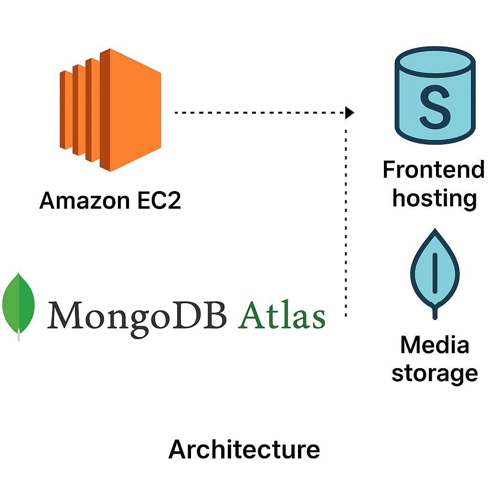
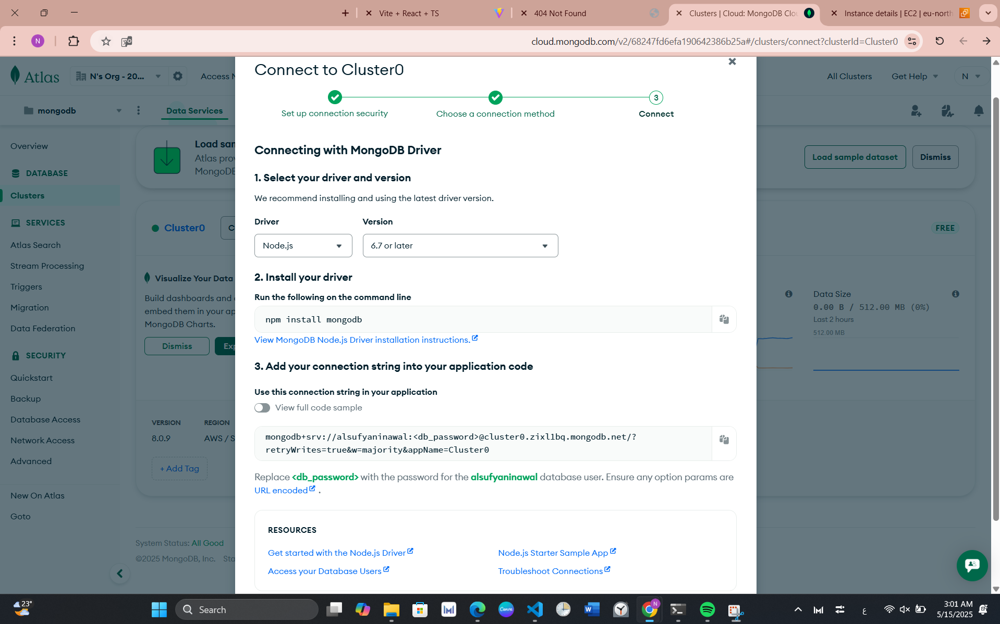
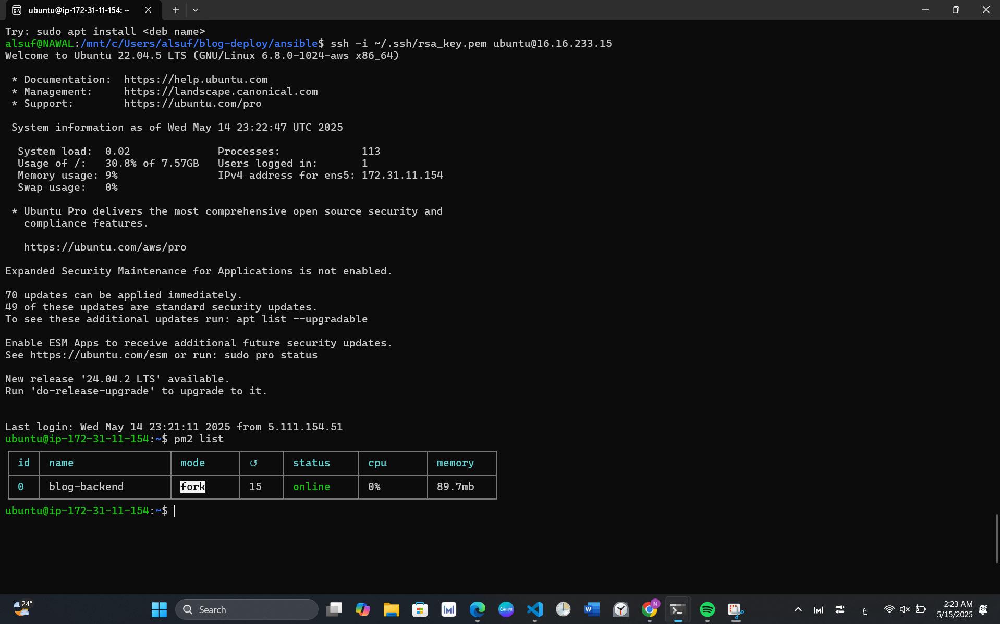

# 🚀 MERN Blog App Deployment

This project demonstrates the **automated deployment** of a full-stack MERN (MongoDB, Express, React, Node.js) blog application on AWS using **Terraform** and **Ansible**.

---

## 🧠 Architecture Overview

A high-level architecture showing integration between:

- EC2 instance hosting the backend
- MongoDB Atlas as a managed database
- S3 for media upload & static frontend hosting

---

## 🗃️ MongoDB Atlas Setup

We used **MongoDB Atlas**, a cloud-hosted NoSQL database, as the primary data store for the blog application.

### 📌 Steps taken:
1. Created a **free-tier MongoDB Atlas cluster**
2. Created a new **database user** with read/write access
3. Whitelisted the **EC2 instance IP** to allow secure connections
4. Retrieved the **connection URI**, and added it to the backend `.env` file:

MONGODB_URI=mongodb+srv://<username>:<password>@cluster0.mongodb.net/<db-name>?retryWrites=true&w=majority

## Backend successfully connected and interacted with MongoDB Atlas for:

User authentication

Blog post creation and fetching

Comments and media references

✅ Verified the connection by running the backend and querying data.

---

## ⚙️ Backend Provisioning with Ansible

Backend is deployed to an Ubuntu EC2 instance using **Ansible Playbook** with PM2.

### Run the backend playbook:

ansible-playbook -i inventory backend-playbook.yml
🟢 PM2 Process Running:
We used PM2 to keep the Node.js server running in the background.

pm2 list

🖼️ Media Uploads to S3
A dedicated S3 bucket is used for storing media uploads such as images.

✔️ Setup:
Created S3 bucket: media-bucket-alsufyani

Configured IAM user for programmatic access

Applied CORS policy

Connected bucket to backend via environment variables

AWS_REGION=eu-north-1
S3_BUCKET=media-bucket-alsufyani
MEDIA_BASE_URL=https://media-bucket-alsufyani.s3.eu-north-1.amazonaws.com

✅ Here's a successful image upload to the bucket:

🌐 Frontend Deployment to S3
The frontend was built using Vite + React and deployed to S3 static website hosting.

.env config:

VITE_BASE_URL=http://<EC2-PUBLIC-DNS>:5000/api
VITE_MEDIA_BASE_URL=https://media-bucket-alsufyani.s3.eu-north-1.amazonaws.com
Build & Deploy:

pnpm run build
aws s3 sync dist/ s3://frontend-bucket-alsufyani/ --delete

🔐 Security Measures
IAM policy for limited S3 access

Security group allows only ports: 22 (SSH), 80 (HTTP), 5000 (App)

Sensitive data handled via .env and excluded from version control

.gitignore includes:

.env
.pem
.terraform/
*.key

## 🛠️ Technologies Used

| 🧰 Tool           | 📝 Purpose                         |
|-------------------|------------------------------------ |
| **AWS EC2**       | Hosting the backend server          |
| **MongoDB Atlas** | Managed NoSQL cloud database        |
| **AWS S3**        | Static frontend + media storage     |
| **Terraform**     | Infrastructure as Code (IaC)        |
| **Ansible**       | Backend provisioning & configuration|
| **PM2**           | Node.js process manager             |
| **Node.js**       | Backend API (Express.js)            |
| **React.js**      | Frontend UI framework               |

🧼 Cleanup Steps
To destroy the created infrastructure:

terraform destroy

Other cleanup steps:

Remove .env and credential files from EC2

Revoke any IAM access keys if used manually

Delete MongoDB users and IP access rules

✅ Submission Checklist
✔️ Terraform configuration files
✔️ Ansible Playbook with roles
✔️ Deployed & running MERN app
✔️ Functional media uploads
✔️ Frontend live on S3
✔️ All screenshots attached
✔️ Secure and cleaned-up repo

Made with ❤️ by NawalSuf
